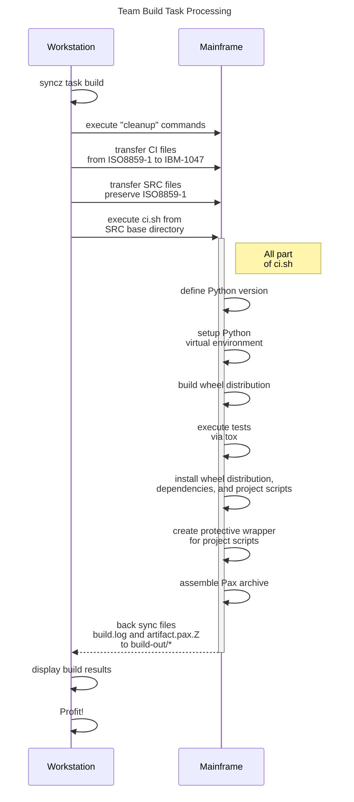

# Python on z/OS

## Sample Project Using `pyproject.toml` and Broadcom Team Build

- The goal of this project is to show the minimum amount of work needed to build a Python artifact, as described in the "Python on z/OS" technical blog series

- This project adopts current (2025-12-10) Python configuration (`pyproject.toml`), testing (`tox`), and packaging (wheel) recommendations

- In addition, this project provides examples on how to use Broadcom Team Build's `syncz` tooling to achieve the desired results:

  - Declarative Python version

  - Zero reliance on installed system site-packages

  - Creation of a portable z/OS artifact

  - Protection from host evolution

  - Nothing to install on the mainframe! Get started today!

### `pyproject.toml`

https://packaging.python.org/en/latest/guides/writing-pyproject-toml/

- Configuration file used by packaging tools, as well as other tools such as linters, type checkers, etc

- Endorsed by the Python Packaging Authority

  - https://www.pypa.io/en/latest/

- Recommended way to package and distribute Python artifacts

### Broadcom Team Build

#### `syncz`

https://techdocs.broadcom.com/us/en/ca-mainframe-software/devops/endevor-team-build/1-0/using/the-syncz-synchronization-tool.html

- Used to synchronize files between workstation and mainframe

  - Inspired by Linux rsync

- Additional capabilities include:

  - Retrieve files from z/OS UNIX or PDSEs

  - Create a ZFS workspace

  - Issue remote shell commands, including remote build initiation after synchronization is completed

  - Nothing required to install on the mainframe!

### Sample Project Details

#### Project Configuration and Structure

- Follows PyPa (Python Packaging Authority) configuration recommendations

  - https://packaging.python.org/en/latest/specifications/pyproject-toml/

- Follows modern layout conventions, as well as common tooling expectations

  - https://medium.com/@adityaghadge99/python-project-structure-why-the-src-layout-beats-flat-folders-and-how-to-use-my-free-template-808844d16f35

```
src/                    # custom code
tests/                  # tests for custom code
.gitignore              # files for Git to ignore
.python-version         # Python vesion to build/test against
ci.sh                   # build script executed on mainframe
pyproject.toml          # Python project config
syncz_vars.example.yml  # Team Build syncz example vars
syncz.yml               # Team Build syncz config
tox.ini                 # test environment config
```

#### The Code

- Simple CLI that has 2 subcommands

  - If we zoom out and think about the big picture, every mainframe Python project is essentially a CLI (executed from USS), whether or not we develop it as such

  - Knowing this, it is a good idea to develop Python projects as such, using libraries and workflows that support this idea

- Uses the `click` library

  - https://click.palletsprojects.com/en/stable/

  - "... package for creating beautiful command line interfaces in a composable way with as little code as necessary"

```
$ tbrocks.wrapped
Usage: tbrocks [OPTIONS] COMMAND [ARGS]...

Options:
  --help  Show this message and exit.

Commands:
  add67  Simple program that adds 67 to NUMBER.
  greet  Simple program that greets NAME for a total of COUNT times.

$ tbrocks.wrapped greet -c 3 Neal
Hello, Neal!
Hello, Neal!
Hello, Neal!

$ tbrocks.wrapped add67 123
190
```

#### Dependencies

- Remember, the artifact is created on the mainframe, which means it needs access to either a supported PyPi index (most likely internal to the enterprise) OR some USS location that stores all required wheel files

- In this example, the mainframe does NOT have access to a supported PyPi index, so we make `pip` aware: 1) not to search any PyPi index, and 2) the location of all supported wheel files

  - `--no-index`: https://pip.pypa.io/en/latest/cli/pip_install/#cmdoption-no-index

    - can also be defined with environment variable `PIP_NO_INDEX=1`

  - `--find-links`: https://pip.pypa.io/en/latest/cli/pip_install/#cmdoption-f

    - can also be defined with environment variable `PIP_FIND_LINKS=/path/to/wheel/files`

#### Build Sequence

- **Workstation:** any machine (local, CI "runner", etc.) used during development

- **Mainframe:** any LPAR developed against

- Task execution can be done locally and/or in any common CI "runner" (GitHub Actions, Jenkins, GitLab CI/CD, etc.)

  - Depends on where you are at in the development cycle

  - `syncz` supports multiple OSes and architectures

  - ```shell
    syncz task build
    ```


